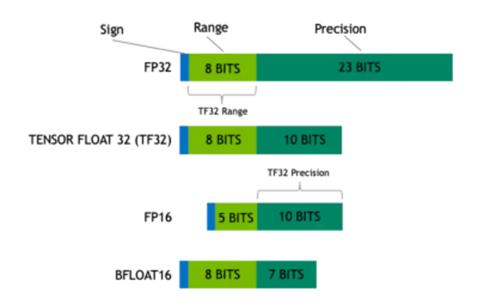

# float4

cuda里面一种特殊的数据类型，下面是类型的定义：

```cpp
struct __device_builtin__ __builtin_align__(16) float4
{
    float x, y, z, w;
};
```

在cpp中的转换方法直接使用`reinterpret_cast<float4*>()`来转换即可，但是务必保证后面要有4个浮点数！使用float4的最大的好处就是
可以增加内存效率，因为一次性读取四个浮点数肯定比读四次浮点数效率要高很多。

---

# half

[CUDA 编程指南](https://docs.nvidia.com/cuda/cuda-c-programming-guide/index.html?highlight=half#bit-floating-point-textures)

CUDA 数组支持的 16 位浮点或半格式与 IEEE 754-2008 binary2 格式相同。

当然知道，`half` 和 `half2` 是 CUDA 中用于 **16-bit 半精度浮点数（FP16）** 的数据类型，它们常用于 **深度学习加速** 或 **内存带宽受限场景**。以下是详细解释：

---

## 🧮 1. `half` 是什么？

`half` 是 CUDA 中的 **16位 IEEE 754 半精度浮点数** 类型，具有如下位结构：

| 符号位 (sign) | 指数位 (exponent, 5 bits) | 尾数 (mantissa, 10 bits) |
| ---------- | ---------------------- | ---------------------- |
| 1 bit      | 5 bits                 | 10 bits                |

### 特点：

* 占用 2 字节（16 bit）
* 表示范围远小于 `float`（32-bit），精度也较低
* 适用于深度学习中对精度不敏感但对带宽或存储敏感的场景

---

## 🧊 2. 如何使用 `half`？

需要 `#include <cuda_fp16.h>`，然后就可以声明和操作 `half` 类型：

```cpp
#include <cuda_fp16.h>

__global__ void kernel(half *a, half *b, half *c) {
    int i = threadIdx.x;
    c[i] = __hadd(a[i], b[i]);  // 使用 CUDA 的 half 加法指令
}
```

### 常见的 half 运算函数（以 `__hadd` 为例）：

| 函数                    | 说明             |
| --------------------- | -------------- |
| `__hadd`              | half 加法        |
| `__hsub`              | half 减法        |
| `__hmul`              | half 乘法        |
| `__hdiv`              | half 除法        |
| `__float2half(float)` | float 转换为 half |
| `__half2float(half)`  | half 转换为 float |

---

## 🧱 3. `half2` 是什么？

`half2` 是 CUDA 中的一个 **向量类型**，表示 **两个 half 组成的结构**，主要用于 **SIMD 风格的并行计算**。

```cpp
typedef struct __align__(4) {
    half x;
    half y;
} half2;
```

### 使用示例：

```cpp
__global__ void kernel(half2 *a, half2 *b, half2 *c) {
    int i = threadIdx.x;
    c[i] = __hadd2(a[i], b[i]);  // SIMD 两个 half 相加
}
```

### 常见 half2 运算函数：

| 函数                          | 说明                    |
| --------------------------- | --------------------- |
| `__hadd2`                   | 两个 `half2` 向量逐位加法     |
| `__hmul2`                   | 两个 `half2` 向量逐位乘法     |
| `__half2float2(half2)`      | 转换为两个 float           |
| `__floats2half2_rn(f1, f2)` | 两个 float 转 half2，四舍五入 |

---

## 💡 4. 注意事项

* 不是所有的 GPU 都对 `half` 和 `half2` 提供硬件加速，要注意你的 GPU 架构是否支持 FP16（例如 Volta、Turing、Ampere 等）
* `half2` 只能在支持向量化的架构中使用其加速指令
* CPU 端并不能直接使用 `half` 运算，需要通过 `__half` 类型以及手动转换

## 5. 复习一下数据精度



---
